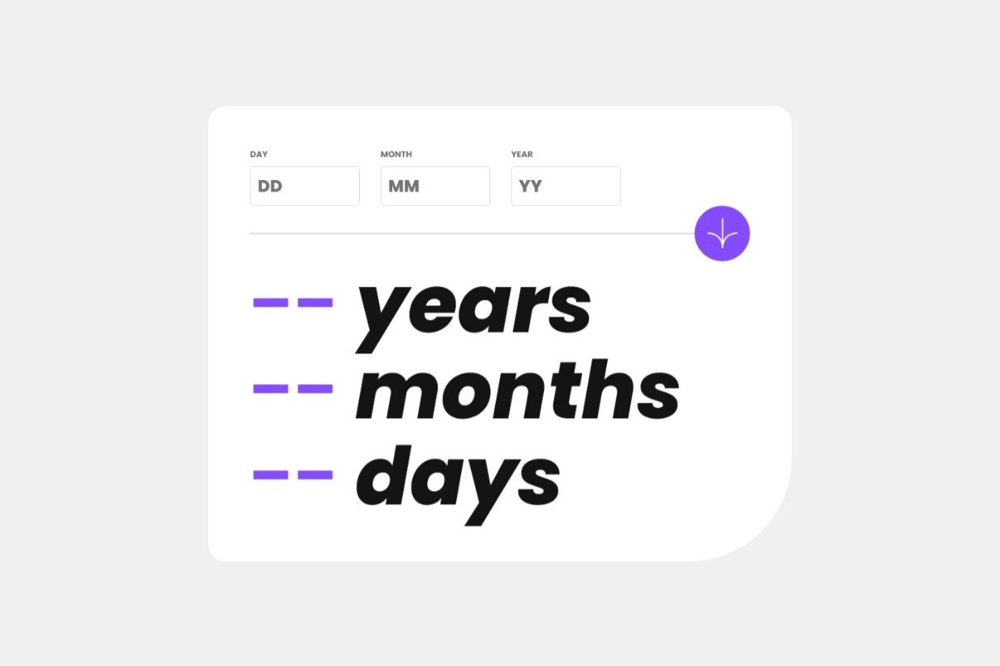
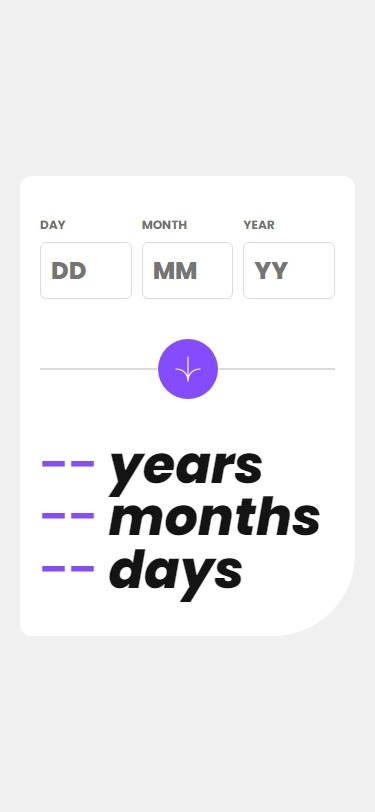

# Life Clock (Age Calculator App 🧮)
This project is a simple age calculator. The user enters their date of birth (year, month, and day), and the app calculates their age in years, months, and days. It includes input validation and animated number increments. Click [here]() to visit the website ☺️.

**Note:** This is a solution to the [Age Calculator App Challenge on Frontend Mentor](https://www.frontendmentor.io/challenges/age-calculator-app-dF9DFFpj-Q).

## Table of Contents

- [Overview](#overview)
  - [Challenge Requirements](#challenge-requirements)
  - [What I Implemented](#what-i-implemented-🤔)
  - [Screenshots](#screenshots-📸)
- [Author](#author)

## Overview

### Challenge Requirements 🏳
> Users should be able to:
> - View an age in years, months, and days after submitting a valid date through the form.
> - Receive validation errors if:
>   - Any field is empty when the form is submitted.
>   - The day number is not between 1-31.
>   - The month number is not between 1-12.
>   - The year is in the future.
>   - The date is invalid (e.g., 31/04/1991, as April has only 30 days).
> - View the optimal layout for their device’s screen size.
> - See hover and focus states for all interactive elements on the page.
> - **Bonus**: See the age numbers animate to their final value when the form is submitted.

### What I Implemented 🤔
I implemented all of the above requirements. Additionally, I included input validation both when the calculate button is clicked and when the input field loses focus (this happens after clicking, not before).

### Screenshots 📸
#### Original Design

#### My Implementation 😎

#### Mobile Design & My Implementation
 

**Notes:**
- I centered my version as I found it more visually appealing.
- I couldn’t match the exact padding, width, and other dimensions from the design, so my version may look slightly different 🌚.

<!-- ### Links -->
<!-- - Live Site URL: [Title]() -->

## Author
- Me 😎 ([@mohammed-Aljablai](https://github.com/mohammed-aljablai))